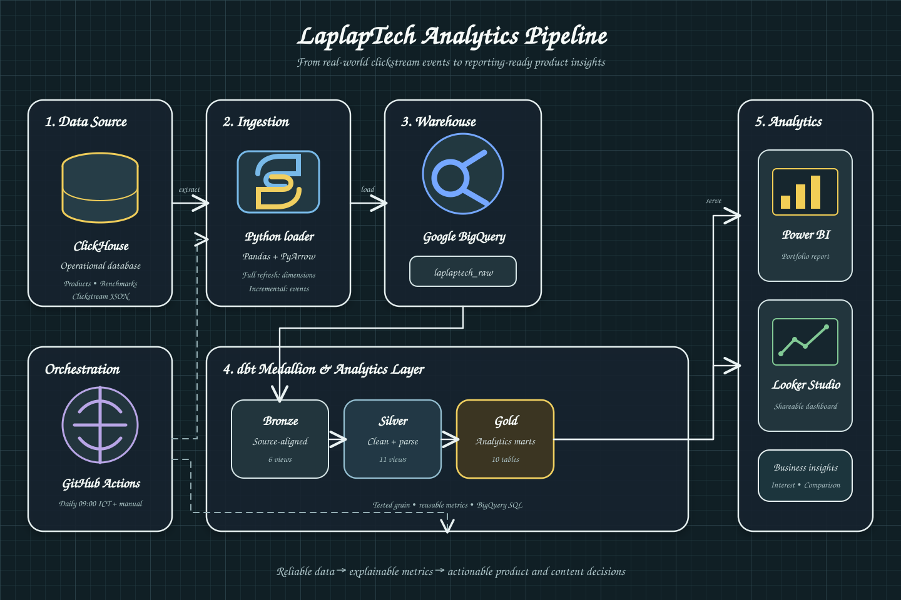

# LaplapTech Analytics Pipeline

[](https://github.com/tduong-p/laplaptech-analysis/actions/workflows/sync-clickhouse-to-bigquery.yml)
[](https://github.com/tduong-p/laplaptech-analysis/commits/main)

> An end-to-end analytics pipeline that moves real-world product and clickstream data from ClickHouse to BigQuery, transforms it with dbt (Bronze -> Silver -> Gold), and serves analytics-ready marts to Power BI or Looker Studio.

LaplapTech is a technology product comparison website. This project studies how visitors browse, evaluate, and compare laptops, then converts those behaviors into recommendations for technology reviewers, content teams, and marketing agencies.

## TL;DR

- **Data:** Real-world LaplapTech product, benchmark, and clickstream data from ClickHouse.
- **Pipeline:** Python ingestion -> BigQuery -> dbt Bronze/Silver/Gold -> Power BI or Looker Studio.
- **Analysis:** Product interest, comparison behavior, sorting criteria, behavioral funnels, and product-data update priorities.
- **Audience:** Technology reviewers, content teams, and technology-focused marketing agencies.
- **Current state:** The pipeline and analytical marts are implemented; live validation, metric calibration, and the final BI report are in progress.
- **Start here:** Read [`context.md`](context.md) for the business questions or explore [`dbt/models/gold`](dbt/models/gold) for reporting-ready models.

## Why I built this

I wanted to practice analytics on data that behaves more like a real system: nested JSON, imperfect timestamps, repeated events, normalized product tables, and business questions that do not arrive with a predefined dashboard.

The goal is not simply to demonstrate that the pipeline runs. I use the project to document how an analyst moves from an ambiguous question, through ad hoc exploration and grain definition, into tested dbt models and a report that can support a decision. Both the useful conclusions and the limitations are part of the portfolio.

## Project status

**Active development.** The ingestion workflow, BigQuery-compatible dbt layers, analytical marts, and documentation are in place. Live warehouse validation, metric calibration, and the final Power BI report are still in progress.

## Dataset provenance and attribution

The dataset was contributed by [**Nguyễn Ngọc Duy Luân (Duy Luân Dễ Thương)**](https://www.facebook.com/duyluannice). It was shared with the [**Xóm Data** community](https://www.facebook.com/groups/xomdata) as a practical learning dataset from the LaplapTech website project.

According to the original community introduction, the data comes from an operational ClickHouse database hosted in the contributor's own data center. It was shared so learners could practice with realistic relational and clickstream data rather than relying only on fully cleaned demonstration datasets such as Superstore or Titanic.

Many thanks to Nguyễn Ngọc Duy Luân for making this learning opportunity available to the community.

### Usage note

- This repository does not redistribute the raw database, connection credentials, or personal secrets.
- The data is used here for educational analytics and portfolio development.
- No formal data license was included in the source description available to this project. Anyone reusing or redistributing the raw data should follow the contributor's and community's original access terms.
- This is an independent learning project and should not be interpreted as an official LaplapTech report.

## Project context

The product catalog contains fewer than 200 devices, so it is not broad enough to represent the entire electronics market or support manufacturer-level production decisions. The event stream, however, contains rich behavioral signals.

The project therefore focuses on five questions:

1. Is the event-tracking data reliable enough for behavioral analysis?
2. Which products attract the most page-level interest?
3. Which products and product segments require deeper comparison?
4. Which specifications do users actively sort by during comparison?
5. Which high-interest products should have their data completed or updated first?

The detailed business context, analytical assumptions, stakeholders, pain points, and ad hoc question backlog are documented in [`context.md`](context.md).

## Architecture



The GitHub Actions workflow runs at `02:00 UTC` every day, approximately `09:00` in Vietnam, and can also be triggered manually.

### Architectural components

| Layer | Technology | Responsibility |
|---|---|---|
| Source | ClickHouse | Stores operational product, benchmark, and clickstream data |
| Ingestion | Python, Pandas, PyArrow | Extracts ClickHouse data and loads it into BigQuery |
| Cloud warehouse | BigQuery | Stores raw data and dbt-built analytical relations |
| Transformation | dbt Core | Applies Bronze, Silver, and Gold modeling logic |
| Orchestration | GitHub Actions | Runs scheduled ingestion and optionally executes `dbt build` |
| Serving | Power BI / Looker Studio | Presents analysis from stable Gold marts |

## Technology stack

- **Source database:** ClickHouse
- **Cloud warehouse:** Google BigQuery
- **Ingestion:** Python, Pandas, PyArrow, `clickhouse-connect`
- **Transformation:** dbt Core and dbt BigQuery
- **Orchestration:** GitHub Actions
- **Visualization:** Power BI or Looker Studio
- **Version control:** Git and GitHub

## Source data model

The ingestion job synchronizes six source tables:

```text
brand
cpu_model
gpu_model
laptop_benchmark_result
laptop_model
user_event_tracking
```

Product and reference tables use full refresh. `user_event_tracking` currently uses a timestamp watermark and append-based incremental loading.

### `user_event_tracking` - clickstream data

The largest and most behaviorally rich table records actions such as page views, searches, clicks, comparison events, and chart sorting. The `event_data` and `device` columns contain JSON payloads, creating realistic parsing, validation, and schema-evolution challenges.

Examples of extracted attributes include:

```text
device_id
page_name
search keyword
operating system
comparison device IDs
comparison sort criterion
sort direction
```

### `laptop_model` - product master data

This table describes each laptop and connects it to brand, CPU, and GPU entities. Available attributes include battery capacity, laptop and charger weight, screen size and dimensions, screen PPI, TDP values, product-segment flags, and product-image metadata.

### `laptop_benchmark_result` - measured performance data

This table contains practical test results collected for laptop models and joins back through `laptop_model_id`. Depending on the record, fields include office and gaming battery duration, plugged-in and battery Geekbench 6 results, notes, and review-video information.

This creates an analytical bridge between:

```text
observed user interest
<-> product specifications
<-> measured performance
```

### `brand`, `cpu_model`, and `gpu_model` - normalized dimensions

These tables separate descriptive entities from the laptop master table. They provide realistic practice for multi-table joins and can support a star-like analytical model in the warehouse or BI semantic layer.

## Why the dataset is useful for practice

The source combines several tasks commonly encountered in analytics work:

- Parsing semi-structured JSON clickstream payloads.
- Validating event timestamps and session identifiers.
- Joining normalized product dimensions.
- Connecting behavioral data with product specifications and benchmarks.
- Defining grain before calculating metrics.
- Separating reusable warehouse logic from BI calculations.
- Migrating transformations from ClickHouse SQL to BigQuery SQL.
- Building scheduled ingestion, dbt models, tests, and reporting marts.

The original community challenge suggested three learning levels:

1. Extract product IDs and search keywords from event JSON.
2. Join laptop, brand, CPU, and GPU tables into a readable product catalog.
3. Combine user behavior with benchmark results to investigate whether laptops with strong real-world battery performance receive different levels of views or comparison interest than gaming-oriented, high-benchmark machines.

This repository extends those exercises into a repeatable cloud analytics pipeline.

## dbt model layers

### Bronze

Six views preserve the BigQuery raw tables with minimal transformation.

### Silver

Eleven views standardize product entities, Boolean fields, timestamps, event attributes, and conformed behavioral facts. Server-received time is used as the canonical analytics timestamp because client-local timestamps were found to contain large anomalies.

| Model | Grain | Purpose |
|---|---|---|
| `silver_user_event_tracking` | One row per event | Standardized timestamps plus parsed `page_name`, `device_id`, and `behavior_group` |
| `silver_device_traffic_event` | One row per valid DeviceDetail event | Product-detail traffic events |
| `silver_session_activity` | One row per session | Session activity and behavioral flags |
| `silver_session_funnel` | One row per DeviceDetail session | Ordered funnel step timestamps |
| `silver_comparison_session_device` | One row per session and device | Distinct devices involved in comparison sessions |
| `silver_comparison_sort_event` | One row per sort event | Exact `device_ids`, `sort_by`, and `sort_direction` |
| Plus five dimension and benchmark views | Source entity | Brand, CPU, GPU, laptop master, and benchmark results |

Logic that is used by only one reporting mart is inlined directly into that mart as a CTE, so the project keeps a clean Bronze -> Silver -> Gold structure without a separate intermediate layer.

### Gold

| Model | Grain | Analytics use |
|---|---|---|
| `mart_daily_site_kpis` | One row per date | Website traffic, user, session, discovery, and comparison KPIs |
| `mart_behavior_funnel_daily` | One row per date and funnel step | Funnel conversion and drop-off |
| `mart_device_traffic` | One row per date and product | Product-detail views and viewing sessions |
| `mart_compared_devices_daily` | One row per date and product | Daily comparison interest |
| `mart_most_compared_devices` | One row per product | All-time comparison ranking derived from the daily mart |
| `mart_product_interest` | One row per week and product | View/comparison interest score and segment |
| `mart_comparison_segment_pairs` | One row per segment pair | Product segments commonly considered in the same session |
| `mart_comparison_sort_criteria` | One row per segment pair, criterion, and direction | Specifications actively used to sort comparison tables |
| `mart_product_data_quality_priority` | One row per active product | Product-data update priority |
| `mart_user_os` | One row per session and OS | Operating-system distribution for sessions |

## Core analytical definitions

### General product interest

A valid event whose JSON payload has `page_name = 'DeviceDetail'` and a valid `device_id`.

### Comparison interest

A product appearing in comparison-related events within a session. Duplicate product IDs inside the same session are counted once.

### Exact comparison sorting context

The `comparison_chart_sort_selection` payload contains:

```json
{
  "device_ids": ["27", "44", "24"],
  "sort_by": "office_battery_life",
  "sort_direction": "asc"
}
```

This payload makes it possible to associate a sorting criterion with the exact products present in that comparison, rather than inferring them from every event in the session.

### Product-data update priority

The first scoring version combines:

```text
product interest
+ recent interest trend
+ missing critical specifications
```

This is an analytical heuristic and should be recalibrated after inspecting real distributions and receiving stakeholder feedback.

## Repository structure

```text
laplaptech-analysis/
├── .github/
│   └── workflows/
├── README.md
├── context.md
├── DEVLOG.md
├── requirements.txt
├── docs/
│   ├── assets/
│   │   └── laplaptech-architecture.svg
│   └── report-storytelling-plan.md
├── ingestion/
│   └── clickhouse_to_bigquery.py
└── dbt/
    ├── dbt_project.yml
    ├── profiles.yml
    ├── models/
    │   ├── sources.yml
    │   ├── model_tests.yml
    │   ├── bronze/
    │   ├── silver/
    │   └── gold/
    ├── analyses/
    ├── macros/
    ├── seeds/
    ├── snapshots/
    └── tests/
```

## Running locally

### Prerequisites

- Python 3.11 or a compatible Python 3 release.
- A Google Cloud project with BigQuery enabled.
- A service account with the required BigQuery permissions.
- Authorized access to the source ClickHouse database.
- dbt Core with the BigQuery adapter, installed through `requirements.txt`.

### 1. Create an environment

```bash
git clone https://github.com/tduong-p/laplaptech-analysis.git
cd laplaptech-analysis
python -m venv .venv
source .venv/bin/activate
pip install -r requirements.txt
```

### 2. Configure environment variables

The dbt profile expects:

```text
GCP_PROJECT_ID
GCP_SERVICE_ACCOUNT_JSON
BIGQUERY_LOCATION
BIGQUERY_DBT_DATASET
LAPLAPTECH_SOURCE_DATABASE
LAPLAPTECH_SOURCE_SCHEMA
```

Do not commit service-account keys or database credentials.

### 3. Validate and build

```bash
cd dbt
dbt debug
dbt build
```

## GitHub Actions deployment

Configure these repository secrets:

```text
CLICKHOUSE_HOST
CLICKHOUSE_PORT
CLICKHOUSE_USER
CLICKHOUSE_PASSWORD
CLICKHOUSE_DATABASE
CLICKHOUSE_SECURE
GCP_PROJECT_ID
GCP_SERVICE_ACCOUNT_JSON
```

Optional repository variables:

```text
BIGQUERY_LOCATION=asia-southeast1
BIGQUERY_RAW_DATASET=laplaptech_raw
BIGQUERY_DBT_DATASET=laplaptech_dev
RUN_DBT_BUILD=true
```

The workflow:

1. Installs Python and project dependencies.
2. Synchronizes ClickHouse tables to BigQuery.
3. Runs `dbt debug` and `dbt build` when `RUN_DBT_BUILD=true`.

## BI usage

Power BI and Looker Studio should read gold marts rather than raw or bronze models.

For Power BI, Import mode is appropriate for the current project size. BigQuery and dbt define reusable grain and business logic; Power BI should handle relationships, filter-context measures, and visualization.

## Data quality and tests

The dbt project includes tests for important keys, accepted behavior groups, funnel sessions, date grain, product completeness, and priority categories.

Important checks still include:

- Duplicate events and duplicate event IDs
- Null or multi-user `session_id` values
- Missing dates or abnormal event-volume spikes
- Correct JSON keys for newly observed event types
- Late-arriving events in the incremental ingestion process

## Known limitations

- The product catalog is small and not representative of the entire market.
- Session-based product pairs do not always prove that products appeared in the same comparison table. Sort-event payloads are more reliable because they contain exact `device_ids`.
- The append-based event ingestion is safe for sequential runs but is not fully idempotent under concurrent execution.
- Late-arriving events older than the current timestamp watermark can be missed.
- Interest and priority scores are analytical heuristics rather than validated business rules.
- A true content-opportunity model requires a content inventory containing published topics, dates, formats, and coverage.

## Next steps

- Replace append-only event ingestion with staging and `MERGE ON id`.
- Add workflow concurrency protection.
- Validate all dbt models against the live BigQuery schema.
- Review score distributions and recalibrate weighting rules.
- Build the Power BI semantic model and report pages.
- Add report screenshots and final findings to this README.

## Support and contributions

This is primarily a personal learning and portfolio project. Questions, bug reports, and suggestions can be submitted through [GitHub Issues](https://github.com/tduong-p/laplaptech-analysis/issues).

Pull requests are welcome when they preserve the documented model grain, use BigQuery-compatible SQL, avoid committing credentials or raw private data, and include appropriate dbt tests or validation notes.

Project decisions and recent work are recorded in [`DEVLOG.md`](DEVLOG.md). It acts as a transparent development journal: what changed, why it changed, which assumptions remain open, and what I learned along the way.

## License

No software license has been added to this repository yet. Until a license is explicitly provided, the source code should not be assumed to be licensed for reuse or redistribution.

The underlying LaplapTech dataset is separate from this repository. Its use remains subject to the access terms provided by the dataset contributor and the Xóm Data community.

## Documentation

- [Business and analytical context](context.md)
- [Development log](DEVLOG.md)
- [Report storytelling plan](docs/report-storytelling-plan.md)

## Acknowledgements and community

This project grew from a community contribution and is intended to keep that learning spirit alive. If you explore the dataset or find a different interpretation, discussion through an Issue is welcome.

- Dataset contributor: [Nguyễn Ngọc Duy Luân — Duy Luân Dễ Thương](https://www.facebook.com/duyluannice)
- Community: [Xóm Data](https://www.facebook.com/groups/xomdata)
